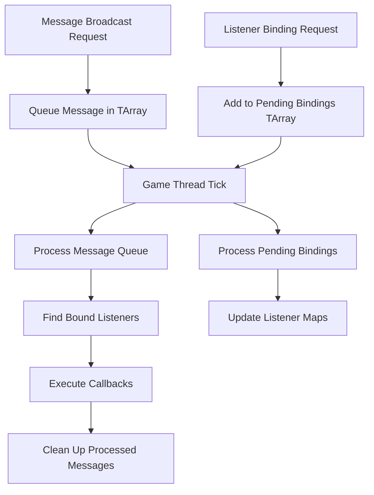
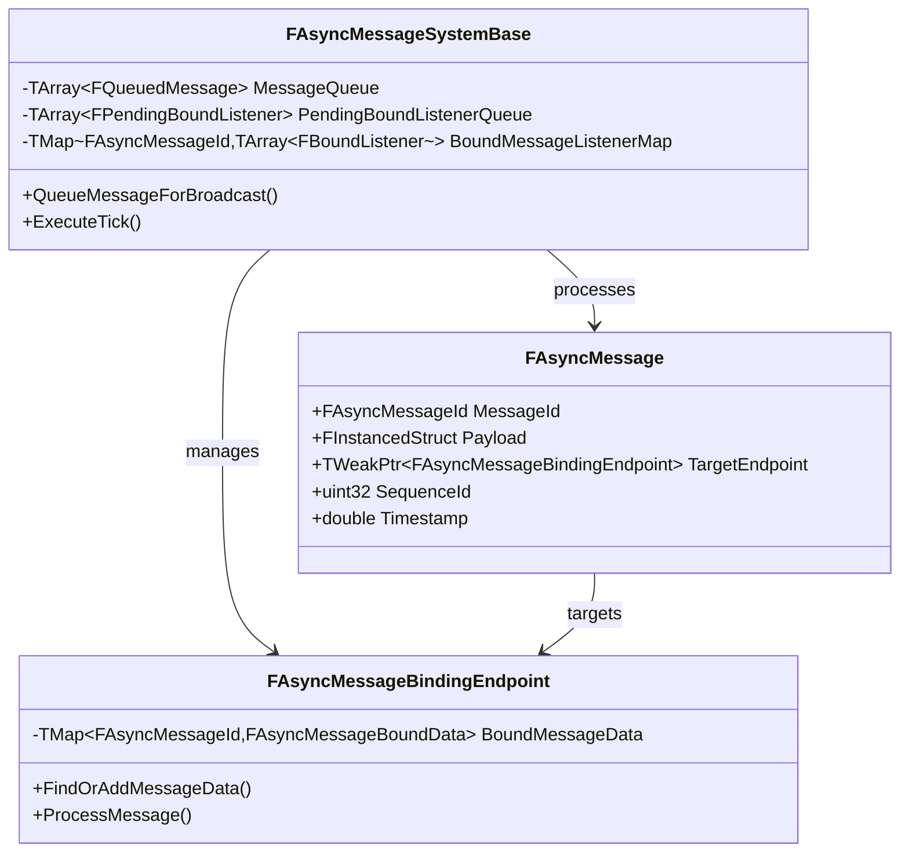
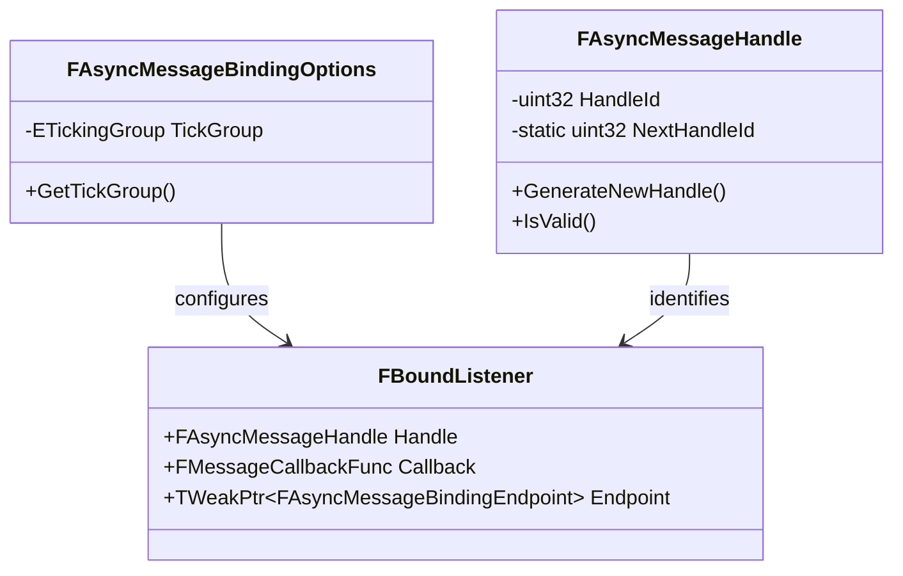

# Design Document

## Overview

This design document outlines the architecture for migrating the AsyncMessageSystem Unreal Engine plugin from a multi-threaded to a single-threaded implementation. The migration will preserve all core messaging functionality while simplifying the codebase by removing thread synchronization complexity.

The single-threaded design will process all messages on the game thread using Unreal Engine's tick system, making the plugin easier to understand, debug, and maintain while providing deterministic behavior.

## Architecture

### Current Multi-Threaded Architecture Issues

The current system uses:
- Thread-safe containers (TMpscQueue) for cross-thread message passing
- Atomic variables for thread-safe ID generation
- Critical sections (FCriticalSection, FScopeLock) for data protection
- Async task processing (UE::Tasks, ENamedThreads)
- Thread-safe shared pointers (ESPMode::ThreadSafe)

### New Single-Threaded Architecture

The new architecture will:
- Use standard containers (TArray, TMap) instead of thread-safe versions
- Replace atomic variables with regular integers
- Remove all locking mechanisms
- Process messages exclusively on the game thread via tick groups
- Use non-thread-safe shared pointers (ESPMode::NotThreadSafe)

### Core Processing Flow



## Components and Interfaces

### 1. AsyncMessageBindingOptions

**Purpose**: Simplified binding configuration
**Changes**:
- Remove `UseNamedThreads` and `UseTaskPriorities` enum values
- Keep only `UseTickGroup` for game thread processing
- Remove thread-related constructors and methods

**New Interface**:
```cpp
enum class EAsyncMessageBindingOptions : uint8
{
    UseTickGroup = 0  // Only option - process on game thread
};

class FAsyncMessageBindingOptions
{
public:
    FAsyncMessageBindingOptions(ETickingGroup TickGroup = TG_DuringPhysics);
    
    ETickingGroup GetTickGroup() const { return TickGroup; }
    
private:
    ETickingGroup TickGroup;
};
```

### 2. AsyncMessageSystemBase

**Purpose**: Core message processing engine
**Changes**:
- Replace TMpscQueue with TArray for message queues
- Remove all FCriticalSection and FScopeLock usage
- Simplify message processing to single-threaded operations
- Remove async task spawning

**Key Methods**:
```cpp
class FAsyncMessageSystemBase
{
private:
    // Replace thread-safe queue with simple array
    TArray<FQueuedMessage> MessageQueue;
    TArray<FPendingBoundListener> PendingBoundListenerQueue;
    TArray<FAsyncMessageHandle> UnbindHandleRequestQueue;
    
    // Remove critical sections
    // FCriticalSection MessageListenerMapCS; // REMOVED
    
    // Simplified processing methods
    void ProcessMessageQueueForBinding_Impl();
    void ProcessUnbindHandleRequests();
    void ProcessListenersPendingBinding();
    
public:
    // Main tick processing - single entry point
    void ExecuteTick(float DeltaTime, ETickingGroup TickGroup);
};
```

### 3. AsyncMessage Structure

**Purpose**: Message data container
**Changes**:
- Remove `ThreadQueuedFrom` field
- Simplify constructor to not capture thread information
- Remove thread-related debugging data

**New Structure**:
```cpp
struct FAsyncMessage
{
    FAsyncMessageId MessageId;
    FInstancedStruct Payload;
    TWeakPtr<FAsyncMessageBindingEndpoint> TargetEndpoint;
    uint32 SequenceId;  // Simple counter, no atomic needed
    double Timestamp;   // For debugging/profiling
    
    // Constructor simplified - no thread capture
    FAsyncMessage(const FAsyncMessageId& InMessageId, 
                  const FInstancedStruct& InPayload,
                  TWeakPtr<FAsyncMessageBindingEndpoint> InEndpoint = nullptr);
};
```

### 4. AsyncMessageStore

**Purpose**: Message storage and retrieval
**Changes**:
- Replace thread-safe containers with standard TMap/TArray
- Remove locking mechanisms
- Simplify storage operations

**New Implementation**:
```cpp
class FAsyncMessageStore
{
private:
    TMap<FAsyncMessageId, TArray<FAsyncMessage>> StoredMessages;
    // Remove: mutable FCriticalSection StorageCS;
    
public:
    void StoreMessage(const FAsyncMessage& Message);
    TArray<FAsyncMessage> RetrieveMessages(const FAsyncMessageId& MessageId);
    void ClearMessages(const FAsyncMessageId& MessageId);
};
```

### 5. AsyncMessageHandle

**Purpose**: Handle management for message bindings
**Changes**:
- Replace atomic handle ID generation with simple counter
- Remove thread-safety considerations

**New Implementation**:
```cpp
class FAsyncMessageHandle
{
private:
    static uint32 NextHandleId;  // Simple counter, no atomic
    uint32 HandleId;
    
public:
    static FAsyncMessageHandle GenerateNewHandle();
    bool IsValid() const { return HandleId != 0; }
};
```

### 6. AsyncGameplayMessageSystem

**Purpose**: Gameplay-specific message processing
**Changes**:
- Remove async task processing
- Keep only tick group functionality
- Simplify message routing

### 7. AsyncMessageWorldSubsystem

**Purpose**: World-level message system management
**Changes**:
- Change shared pointer mode from ThreadSafe to NotThreadSafe
- Simplify subsystem lifecycle management

**New Implementation**:
```cpp
class UAsyncMessageWorldSubsystem : public UWorldSubsystem
{
private:
    TSharedPtr<FAsyncMessageSystemBase, ESPMode::NotThreadSafe> MessageSystem;
    
public:
    static TSharedPtr<FAsyncMessageSystemBase, ESPMode::NotThreadSafe> 
        GetSharedMessageSystem(UWorld* World);
};
```

## Data Models

### Message Flow Data Model



### Binding Data Model



## Error Handling

### Error Categories

1. **Message Broadcasting Errors**
   - Invalid world context
   - Missing message system
   - Invalid message ID or payload

2. **Listener Binding Errors**
   - Invalid callback function
   - Duplicate handle registration
   - Invalid endpoint reference

3. **System Lifecycle Errors**
   - Subsystem initialization failures
   - Component lifecycle issues
   - Tick group registration problems

### Error Handling Strategy

```cpp
// Centralized error logging with context
#define ASYNC_MESSAGE_ERROR(Format, ...) \
    UE_LOG(LogAsyncMessageSystem, Error, TEXT("[%hs:%d] " Format), __func__, __LINE__, ##__VA_ARGS__)

// Graceful degradation for non-critical errors
bool FAsyncMessageSystemBase::QueueMessageForBroadcast(const FAsyncMessageId& MessageId, 
                                                       const FInstancedStruct& Payload)
{
    if (!MessageId.IsValid())
    {
        ASYNC_MESSAGE_ERROR("Invalid MessageId provided for broadcast");
        return false;
    }
    
    if (!Payload.IsValid())
    {
        ASYNC_MESSAGE_ERROR("Invalid Payload provided for message '%s'", *MessageId.ToString());
        return false;
    }
    
    // Queue message for processing
    MessageQueue.Add(FQueuedMessage(MessageId, Payload));
    return true;
}
```

### Recovery Mechanisms

- **Message Queue Overflow**: Implement queue size limits with oldest message eviction
- **Invalid Listeners**: Automatic cleanup of invalid weak pointer references
- **Tick Processing Errors**: Continue processing remaining messages after logging errors

## Testing Strategy

### Unit Testing Approach

1. **Message Broadcasting Tests**
   ```cpp
   // Test basic message broadcasting
   IMPLEMENT_SIMPLE_AUTOMATION_TEST(FAsyncMessageBroadcastTest, 
       "AsyncMessageSystem.Core.Broadcast", 
       EAutomationTestFlags::ApplicationContextMask | EAutomationTestFlags::ProductFilter)
   ```

2. **Listener Binding Tests**
   ```cpp
   // Test listener registration and callback execution
   IMPLEMENT_SIMPLE_AUTOMATION_TEST(FAsyncMessageListenerTest, 
       "AsyncMessageSystem.Core.Listener", 
       EAutomationTestFlags::ApplicationContextMask | EAutomationTestFlags::ProductFilter)
   ```

3. **System Integration Tests**
   ```cpp
   // Test world subsystem integration
   IMPLEMENT_SIMPLE_AUTOMATION_TEST(FAsyncMessageWorldSubsystemTest, 
       "AsyncMessageSystem.Integration.WorldSubsystem", 
       EAutomationTestFlags::ApplicationContextMask | EAutomationTestFlags::ProductFilter)
   ```

### Performance Testing

- **Message Throughput**: Measure messages processed per tick
- **Memory Usage**: Monitor memory allocation patterns
- **Tick Performance**: Ensure tick processing stays within frame budget

### Blueprint Integration Testing

- **Blueprint Function Calls**: Test all exposed Blueprint functions
- **Component Integration**: Test AsyncMessageBindingComponent lifecycle
- **Developer Settings**: Verify configuration options work correctly

## Migration Benefits

### Simplified Architecture
- **Reduced Complexity**: No thread synchronization code
- **Easier Debugging**: Deterministic execution order
- **Better Performance**: Reduced overhead from locks and atomics

### Improved Maintainability
- **Clearer Code Flow**: Single-threaded execution path
- **Easier Testing**: Predictable behavior for unit tests
- **Better Documentation**: Simpler concepts to explain

### Enhanced Reliability
- **No Race Conditions**: Eliminates threading bugs
- **Predictable Timing**: Consistent tick-based processing
- **Easier Profiling**: Clear performance bottleneck identification

## Implementation Considerations

### Performance Impact
- **Positive**: Reduced locking overhead, better cache locality
- **Negative**: All processing on game thread (may impact frame rate with high message volume)
- **Mitigation**: Implement message processing budgets per tick

### Scalability Limitations
- **Single Thread Bound**: Limited by game thread performance
- **Message Volume**: May need batching for high-volume scenarios
- **Future Threading**: Would require architectural changes if needed later

### Compatibility
- **Blueprint API**: Maintain 100% compatibility
- **Component Interface**: Preserve all existing functionality
- **Developer Settings**: Keep all configuration options